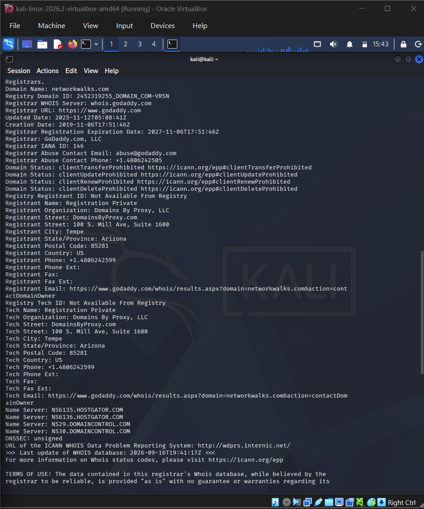
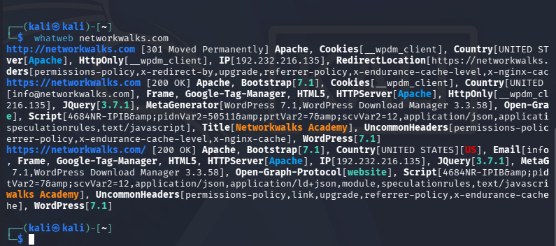
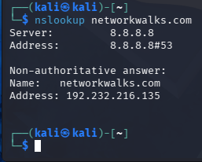

# 🔐 Footprinting & Network Scanning

**Passive reconnaissance of networkwalks.com and local network scanning using Kali Linux tools + Zenmap**


---

## 📌 Project Overview

This project covers two phases of ethical hacking reconnaissance:

1. **Passive footprinting** of the live website **networkwalks.com** using six built-in Kali Linux tools — gathering domain, technology, DNS, and firewall information without ever touching the target directly.
2. **Network scanning** of a local LAN subnet using **Zenmap** (the GUI for Nmap) — discovering live hosts on the network.

Reconnaissance is the first phase of any real attack or authorized security test. None of the tools used here attack a target; they only read information that is already publicly available or scan a subnet the tester owns and controls.

---

## 🎯 Objectives

- Run `whois` to find domain registration details.
- Run `whatweb` to fingerprint the web technologies.
- Run `nslookup` to resolve the domain to its IP address.
- Run `curl -I` to read HTTP response headers.
- Run `wafw00f` to detect a Web Application Firewall.
- Run `dnsrecon` to enumerate all DNS records.
- Run **Zenmap** to discover live hosts on a local subnet.
- Compile all findings into a single pentest-style report.

---

## 🛡️ Scope & Authorization

| Phase | Target | Authorization |
|-------|--------|----------------|
| Footprinting (PM1) | `networkwalks.com` | Program's own designated training target — authorized by Networkwalks for student practice |
| Network Scanning (PM5) | Own local LAN subnet (`10.0.0.0/24`, NAT Network) | Own virtual lab network — full ownership/authorization |

> ⚠️ **Important:** These techniques must only be used against systems you own or have explicit written permission to test.

---

# 🪜 Part 1 — Footprinting: networkwalks.com

## Task 1 — WHOIS: Domain Registration

**Command:**
```
whois networkwalks.com
```




**Findings:**
- Registrar: GoDaddy.com, LLC
- Registered: Nov 6, 2019 → Expires: Nov 6, 2027
- Name Servers: NS6135/NS6136.HOSTGATOR.COM, NS29/NS30.DOMAINCONTROL.COM (hosting → HostGator)
- Registrant identity: privacy-protected via Domains By Proxy, LLC (Tempe, Arizona)
- Abuse contact: abuse@godaddy.com

**How attackers use this:** Name servers reveal the hosting provider instantly. Registrant privacy hides the real owner, but abuse/registrar details still help with social engineering or abuse reporting. Registration/expiry dates help track domain lifecycle.

---

## Task 2 — WhatWeb: Technology Fingerprinting

**Command:**
```
whatweb networkwalks.com
```



**Findings:**
- CMS: WordPress 7.1, plugin WP Download Manager 3.3.58
- Server: Apache, IP `192.232.216.135`
- Stack: Bootstrap 7.1, jQuery 3.7.1, HTML5, Google Tag Manager

**How attackers use this:** Exact WordPress core + plugin versions can be checked against CVE databases for known, exploitable vulnerabilities.

---

## Task 3 — Nslookup: IP Resolution

**Command:**
```
nslookup networkwalks.com
```



**Findings:** Resolved IP — `192.232.216.135` (queried via DNS server 8.8.8.8)

**How attackers use this:** Converts the domain to its real IP, enabling direct scanning and infrastructure mapping.

---

## Task 4 — Curl: HTTP Response Headers

**Command:**
```
curl -I https://networkwalks.com
```


**Findings:**
- HTTP/2 200, Server: Apache
- WordPress REST API exposed at `/wp-json/`
- Caching headers: `x-nginx-cache`, `x-endurance-cache-level` (Endurance/HostGator stack)
- Sets `__wpdm_client` cookie (Secure, HttpOnly)

**How attackers use this:** HTTP headers leak the web server, caching stack, and hidden endpoints (like the REST API) — a common WordPress recon/attack surface — without loading the full page.

---

## Task 5 — Wafw00f: WAF Detection

**Command:**
```
wafw00f networkwalks.com
```


**Findings:** WAF detected — **ModSecurity (SpiderLabs)**

**How attackers use this:** Confirms a firewall is watching; naive attack attempts will likely be blocked or logged, forcing an attacker to adapt or attempt a bypass.

---

## Task 6 — Dnsrecon: DNS Enumeration

**Command:**
```
dnsrecon -d networkwalks.com
```


**Findings:**
- Mail server: mail.networkwalks.com (192.232.216.135)
- DNS software: BIND 9.16.23
- SPF record: `v=spf1 +a +mx +ip4:50.87.144.87 include:websitewelcome.com ~all`
- 8 SRV records — all `_autodiscover._tcp` pointing to cPanel email hosts (`cpanelemaildiscovery.cpanel.net`) → confirms **cPanel hosting**

**How attackers use this:** Maps the full DNS footprint — each record (mail server, DNS software version, SPF policy, SRV records) is a potential foothold and reveals the email/hosting setup.

---

# 🪜 Part 2 — Network Scanning: Local LAN (Zenmap)

## Task 7 — Ping Scan: Live Host Discovery

**Command:**
```
nmap -sn 10.0.0.0/24
```


**Findings:**
- Subnet scanned: `10.0.0.0/24` (VirtualBox NAT Network)
- Live hosts: **2** (10.0.0.1, 10.0.0.2)
- MAC address: `52:54:00:12:35:00` (QEMU virtual NIC) — visible for the gateway host
- Scan completed in 2.92 seconds (256 IP addresses checked)

**How attackers use this:** A ping sweep is the fastest way to map which devices are alive on a network before deciding which hosts to probe further.

## Task 8 — Topology View


**Findings:** Star topology — localhost at center, connected to 10.0.0.1 (gateway) and 10.0.0.2 (own Kali VM).

---

# 🔎 Summary of Findings

| **Tool**   | **Target** | **Key Finding** |
|------------|------------|------------------|
| whois      | networkwalks.com | GoDaddy registrar, HostGator hosting, privacy-protected owner |
| whatweb    | networkwalks.com | WordPress 7.1 + WP Download Manager 3.3.58, Apache |
| nslookup   | networkwalks.com | IP: 192.232.216.135 |
| curl       | networkwalks.com | HTTP/2 200, WordPress REST API exposed |
| wafw00f    | networkwalks.com | Protected by ModSecurity (SpiderLabs) WAF |
| dnsrecon   | networkwalks.com | BIND 9.16.23, cPanel hosting, 8 SRV records |
| Zenmap (Ping Scan) | 10.0.0.0/24 (own LAN) | 2 live hosts found |

---

# 🐞 Problems Encountered & Solutions

## Problem 1. Shared "Downloads" Folder Permission Denied

**Symptoms:** After the VM's shared folder was reconfigured, `ls /media/sf_Downloads` returned `Permission denied`.

**Cause:** The `kali` user was not part of the `vboxsf` group, which controls access to VirtualBox shared folders.

**Solution:**
```
sudo usermod -aG vboxsf $USER
reboot
```
After rebooting, the shared folder became accessible.

**Lesson:** VirtualBox shared folders require the guest OS user to belong to the `vboxsf` group — a fresh mount alone isn't enough if group membership is missing.

---

# 💡 What I Learned

- Footprinting builds a complete profile of a target using only public information, before any active engagement — this is why it's hard to detect.
- Each tool reveals a different layer: `whois` and DNS tools expose ownership/hosting, `whatweb`/`curl` expose the software stack, `wafw00f` exposes defenses.
- A single misconfigured plugin/CMS version (seen via `whatweb`) can be the entry point an attacker looks for.
- Network scanning with Zenmap is a fast way to discover live hosts on a subnet — a ping scan alone reveals which devices are worth investigating further.
- Passive recon never touches the target directly, which is why it's the safest and stealthiest phase of a security assessment.

---

# 🔐 Security & Ethical Use

This project is intended strictly for **educational purposes and authorized security testing** as part of the Networkwalks Cybersecurity & Ethical Hacking internship.

> ⚠️ **Never use these techniques against unauthorized systems, networks, websites, or devices.**

---

# 👤 Author

**Bhabani Priyadarshini Panda**
Cybersecurity Intern — Batch B083
Networkwalks

**LinkedIn:** <https://linkedin.com/in/bp69>

---

## 📌 Project Information

| **Field**        | **Details**                                  |
|-------------------|-----------------------------------------------|
| **Program Name**  | Cybersecurity at Networkwalks                 |
| **Batch**         | B083                                          |
| **Week**          | 02                                            |
| **Project**       | Footprinting (PM1) + Network Scanning (PM5) + Final Report |
| **Targets**       | networkwalks.com (footprinting), own LAN 10.0.0.0/24 (scanning) |
| **Platform**      | Kali Linux                                    |
| **Repository**    | GitHub                                        |

---

### 🔐 Learn • Practice • Secure

**Cybersecurity Lab — Week 02**
